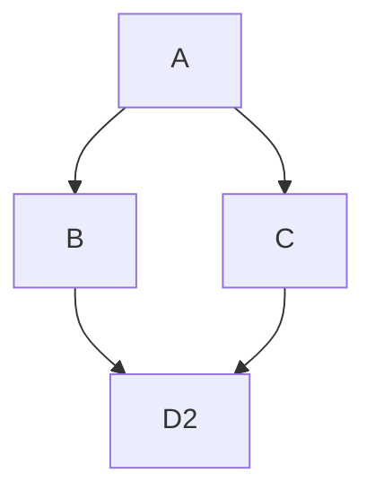
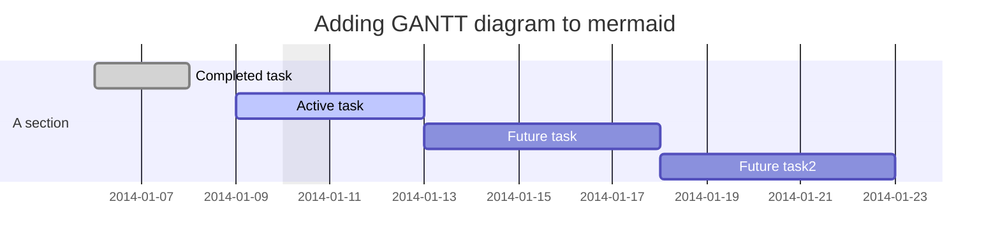

# DART

DART is a tool that fully automates the FPGA design flow for a real-time, dynamic partially reconfigurable (DPR) co-designed system that comprises both software and hardware components. DART fully automates the partitioning, floorplanning, and implementation (routing and bitstream generation) phases of the DPR flow. Besides, DART supports the Zynq 7-series and Ultrascale+ FPGA-based SoCs by Xilinx. 

DART must be used with [FRED](http://fred.santannapisa.it/runtime/) runtime for a complete real-time FPGA offloading solution. While DART automates the hardware design,
FRED manages the hw/sw interface, easing the software application design. 

[TOC]

[DART Introduction and Main Concepts](./docs/concepts.md)
[DART Installation](./docs/install.md)
[Running DART](./docs/running.md)
[DART Tutorial](./docs/tutorial/index.md)





```wavedrom

{ signal : [
  { name: "clk",  wave: "p......" },
  { name: "bus",  wave: "x.34.5x",   data: "head body tail" },
  { name: "wire", wave: "0.1..0." },
]}
```


## Tasks List

- [x] @mentions, #refs, [links](), **formatting**, and <del>tags</del> supported
- [x] list syntax required (any unordered or ordered list supported)
- [x] this is a complete item
- [ ] this is an incomplete item

## Authors

- Biruk Belay Seyoum (June 2021), ReTiS Lab, Scuola Sant'Anna, Pisa, Italy. Main developer.
- Alexandre Amory (June 2021), ReTiS Lab, Scuola Sant'Anna, Pisa, Italy. Tester and minor contributions.


## Papers

Please cite this paper if you are using DART:

```bibtex
@inproceedings{seyoum2021automating,
  title={Automating the design flow under dynamic partial reconfiguration for hardware-software co-design in {FPGA SoC}},
  author={Seyoum, Biruk and Pagani, Marco and Biondi, Alessandro and Buttazzo, Giorgio},
  booktitle={Proceedings of the ACM Symposium on Applied Computing (SAC)},
  pages={481--490},
  year={2021}
}
```


## License


## Acknoledgments

This tool was partially developed in the context of the [AMPERE project](https://ampere-euproject.eu/).
This project has received funding from the European Union’s Horizon 2020 
research and innovation programme under grant agreement No 871669.

