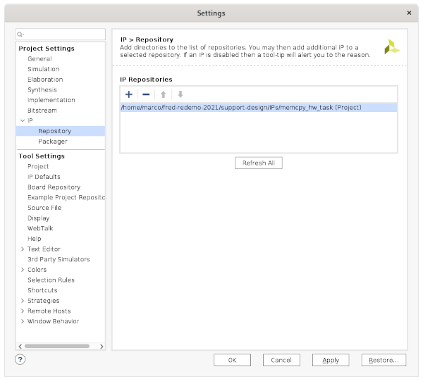
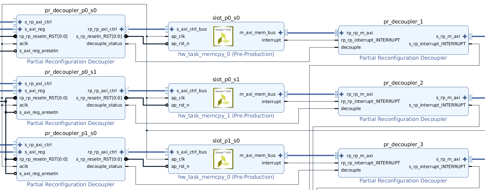
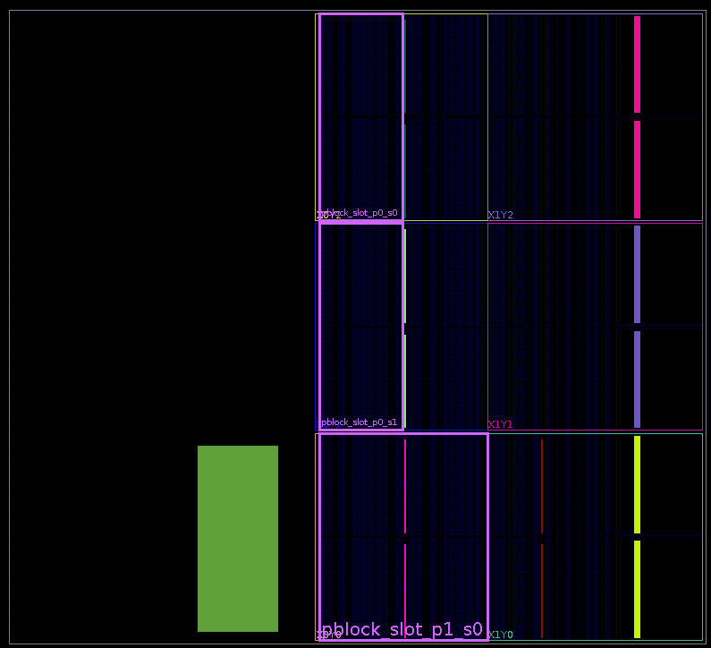

# Fred-Linux tutorial
A brief tutorial on how to use *Fred-Linux* on Zynq UltraScale+ MPSoCs. More specifically, this tutorial targets the Ultra96v2 board as the reference platform.

```
Version 0.3 ZynqUS+ / Ultra96v2
```

## Demo image
This tutorial describes how to build a Fred-Linux demo application on the Ultra96v2 board. You can download a prebuild SD-card image including all sources used in this tutorial from [here](https://owncloud.retis.sssup.it/index.php/s/BF41kgz6rbddBUH).

If you just want to try Fred-Linux on the Ultra96v2 board, copy the demo image on a 16 GB or larger SD card:

```console
$ unzip fred-ultra96v2-demo.zip
$ sudo dd if=fred-ultra96v2-demo.img of=/dev/<sd-card> bs=8M conv=fsync
```

Then, follow these [instructions](#starting-the-demo) for starting the demo.

## Introduction
FRED is a framework for supporting hardware-accelerated real-time application on SoC-FPGA platforms. FRED considers a heterogeneous computing platform comprising one or more general-purpose processors, a DPR-enabled FPGA fabric, and a shared system memory. FRED supports two kinds of computational activities:

- *Software tasks* (SW-tasks) which are computational activities running on the processors;

- *Hardware tasks* (HW-tasks), which are hardware accelerators that can be reconfigured and on the FPGA.

SW-tasks can speed up parts of their computation by requesting the execution of HW-tasks. The FPGA fabric is divided into a set of partitions which in turn are sub-divided into a set of equal-sized slots. Each HW-task has a static affinity to a single partition and can be reconfigured and executed in any slot of its partition.

For a more detailed description of the FRED framework, please refer to this [paper](https://retis.sssup.it/~a.biondi/papers/FRED_RTSS16.pdf).

### Fred-Linux
Fred-Linux is the reference implementation of the FRED framework for GNU/Linux. A Fred-Linux system consists of a set of hardware and software components. More specifically, from bottom to top:

- A set of HW-tasks;
- A PL support design containing a set of reconfigurable slots;
- The Fred-Linux runtime support running on top of GNU/Linux;
- One or more software client applications made of SW-tasks.

The building process of a Fred-Linux system can be divided into three main steps: (i) design and build the HW-tasks and the support design, (ii) build the GNU/Linux environment and the Fred-Linux runtime support, and (iii) design and build the client application. The following sections describe each step in detail.

## Hardware support
This section describes how to build the PL part of a FRED-Linux system, including the HW-tasks and the support design.

> Disclaimer: *The following instructions and the design files have been tested using Vivado 2019.2. Using a more recent version of Vivado may require some changes.*

### HW-tasks
Fred-Linux supports HW-tasks that perform the same computational activity each run and can autonomously access the system memory for sharing data with SW-tasks. All HW-tasks are required to implement the same physical *common* interface, including (i) an AXI lite slave interface for control purposes, (ii) one (or more) AXI master interface for accessing system memory, and (iii) an interrupt line to notify the processor when the computation is complete. The AXI slave interface and its register map are fixed since the Fred-Linux runtime uses them to control the HW-task. On the contrary, the AXI master interfaces are outside the scope of the runtime, and can be customized as needed by the user changing the word size and other parameters.

Fred-Linux compliant HW-tasks can be easily designed with Vivado HLS by customizing the memcopy stub module available on this [repository](https://github.com/marco-pag/fred-mod-hls). HW-tasks can also be designed in VHDL using the memcopy stub available on this [repository](https://github.com/marco-pag/fred-mod-vhdl-lite) as a starting point.

[Here](https://owncloud.retis.sssup.it/index.php/s/gPWuVyZJNeMssAw) you can download the HLS sources of a demo HW-tasks set that will be used later on in this tutorial. The demo set contains five HW-tasks:

- `Vector multiplication`;
- `Vector addition`;
- `Vector subtraction`;
- `Vector bitwise NOR`;
- `Vector bitwise XOR`.

These accelerators perform basic arithmetic and bitwise operations on 1024 elements 32-bit wide vectors, providing a simple and testable HW-tasks set for checking that Fred-Linux operates correctly.

## Support design
A Fred-Linux support design consists of a static portion and a reconfigurable portion. The static portion is outside the scope of Fred-Linux and can be entirely customized according to the requirements. The reconfigurable portion contains a set of reconfigurable slots protected by a set of partial reconfiguration decouplers and the AXI interconnects needed to connect the slots to the PS.

Reconfigurable slots can be thought of as placeholders for HW-tasks. Since all HW-tasks uses the same interface, reconfigurable slots can be instantiated using the aforementioned [memcopy](https://github.com/marco-pag/fred-mod-hls) HW-task. Please note that the AXI master interface part of the placeholder HW-task must be adapted to match the AXI master interfaces of the actual HW-tasks.

The Fred-Linux runtime access only the reconfigurable portion of the support design controlling slots and decouplers. To correctly bind the Fred-Linux runtime with slots and the decouplers, they must be named according to the following convention: The generic slot *i* of partition *j* must be named `slot_pj_si`, and must be paired with a decoupler named `pr_decoupler_pj_si`. Please note that the name of the placeholder HW-task top-level module must match the name of the slot, i.e.,

- `slot_0` -> ` hw_task_0(...)`
- `slot_1` -> ` hw_task_1(...)`
- `slot_N` -> ` hw_task_N(...)`

[Here](https://owncloud.retis.sssup.it/index.php/s/Y9tUSgLif8MgWId) you can download a demo design for the Ultra96v2/ZU3EG board. Inside the package, you can find a Vivado project named `fred-redemo-ultra96`. Open the `xpr` project file with Vivado and check that the IPs repository points to the `IPs` directory (`Project setting -> IPs -> Repository`), which in turn contains the placeholder memcopy HW-tasks IPs.



It's recommended to use this project as a reference for building a Fred-Linux compliant support design for Zynq UltraScale+ MPSoCs. The design contains *three slots* organized into *two partitions*. The first partition, `p0` contains two slots named `slot_p0_s0` and `slot_p0_s1`. The second partition, `p1` contains a single slot named `slot_p1_s0`. All the slots are implemented as instances of the memcopy HW-task, which act as placeholders implementing the common interface used by the demo HW-tasks.



The physical layout of the slots can be defined at this design stage using a set of `pblocks`. For more details, you can refer to [this](https://xilinx-wiki.atlassian.net/wiki/spaces/A/pages/18841851/XAPP1231+-+Partial+Reconfiguration+of+a+Hardware+Accelerator+with+Vivado+Design+Suite) tutorial. While floorplanning the design, remember that the FRED frameworks require that all slots of a partition must contain the same amount of resources.



It is worth noting that the floorplanning (i.e., the mapping between a module and a specific geometrical region of the FPGA) of the slots (i.e., the placeholder accelerators) is defined through a `xdc` constraint file describing the geometry of the slots.

### Partial reconfiguration flow
When the support design and the HW-tasks are ready to be synthesized, they can be plugged into the partial reconfiguration (PR) flow for generating the bitstreams. The PR flow is script-based and requires all input sources to be organized in a specific directory structure as described in this [tutorial](https://xilinx-wiki.atlassian.net/wiki/spaces/A/pages/18841851/XAPP1231+-+Partial+Reconfiguration+of+a+Hardware+Accelerator+with+Vivado+Design+Suite).

An example PR flow allocating the demo HW-tasks on top of the demo support design can be downloaded [here](https://owncloud.retis.sssup.it/index.php/s/P9ZKPxzEPKarw4f). The HW-tasks are allocated in this way:

Partition       | HW-tasks
---             | ---
P0 (2 slots)    | V. Mul, V. Add, V. Sub
P1 (1 slots)    | V. XOR, V. NOR

The PR flow can be customized following these steps:

- Rename the synthesis checkpoint resulting from the [support design synthesis](#pynq-support-design) as `top_synth.dpc` and copy it into the `Synth/Static` directory.

- Copy the top-level wrappers of the slots' placeholder HW-tasks, e.g., `design_1_hw_task_0_0_0.vhd`, etc., into the `Sources/hdl` directory without the black box attribute.

- Copy the design constraint file, e.g., `top.xdc`, and the slots constraints file, e.g., `pblocks.xdc`, into the `Sources/xdc` folder.

Then, for each HW-task, say `my_hw_task`:

- Copy the HLS implementation output into a new `Sources/ip/my_hw_task` directory. Note that the top function name must match the slots name. E.g., for a partition containing two slots (`hw_task_0` and `hw_task_1`), two copies of the same HW-task with different top level functions (`my_hw_task_0` and `my_hw_task_1`) must be provided in two different directories.

- Generate a `my_hw_task_N.prj` (where N is the slot number) project file specifying the HDL / LogiCore sources of the HW-tasks. The `load_prj.py` script can be used to facilitate this process.

Finally, customize the `design.tcl` script accordingly to the changes you made and launch the PR synthesis process with the following command.

```console
$ vivado -mode batch  -source design.tcl

```

The process will go through the synthesis and implementation phases generating the resulting full and partial bitstreams into the `Bitstreams` directory. Please refer to the *Vivado Design Suite Partial Reconfiguration Guide - UG909* for more information on the partial reconfiguration flow.

## Software support
This section describes how to build the software part of a FRED-Linux system, including the OS-level support, the Fred-Linux runtime, and the client application.

### GNU/Linux image
The Fred-Linux runtime requires a GNU/Linux environment. A custom GNU/Linux image can be built using Xilinx's Petalinux, Yocto or Buildroot. However, building a custom image can be a tedious and time-consuming process. For the sake of simplicity, this tutorial uses the pre-build PYNQ 2.6 image for the Ultra96v2 board available from [Avnet](http://avnet.me/ultra96v2-pynq-image-v2.6). The only customization required is to patch the device tree in order to change the compatible property of the `pcap` node to `xlnx,zynqmp-pcap-fpga-fmod` to bind with the Fred-Linux custom fpga-manager driver.

```text
pcap {
	compatible = "xlnx,zynqmp-pcap-fpga-fmod";
	clock-names = "ref_clk";
	clocks = <0x03 0x29>;
	phandle = <0x0b>;
};
```
The device tree can be patched by modifying the U-Boot Flattened uImage Tree (FIT) image named `image.ub` included in the BOOT partition. You can download the patched FIT from [here](https://owncloud.retis.sssup.it/index.php/s/3i2Qs8OXc2vy5bz). Once the download is complete, replace the `image.ub` included in the BOOT partition with the patched image.

### Fred-Linux runtime
Once the image is ready, you can proceed with building the Fred-Linux runtime. The runtime consists of the following components:

- A user-space server process named *fred-server* which handles acceleration requests from SW-tasks according to the FRED scheduling policy;
- A custom kernel module used for allocating memory buffers shared between SW-tasks and HW-tasks;
- A semi-custom low-level FPGA driver for managing FPGA reconfiguration with the FPGA manager framework.

#### Build the fred-server
The source code of the fred-server can be downloaded form this [repository](https://github.com/marco-pag/fred-linux). Once the source code has been downloaded, it can be build on-board using the included Makefile:

```console
$ sudo -i
# mkdir -p /opt/fredsys/build
# cd /opt/fredsys/build
# git clone https://github.com/marco-pag/fred-linux.git
# cd fred-linux
# make
```
The build process will output an executable file called `fred-server`.

#### Build kernel modules
The easiest way to compile the kernel modules is by compiling them directly onboard using the included makefiles. Alternatively, they can be cross-compiled using the appropriate kernel sources. To compile the kernel modules on the PYNQ image 2.6, you can follow these instructions:

Prepare the environment:

```console
# cd /usr/src/kernel
# make modules_prepare
# make scripts
```

Clone the repository and build the modules:

```console
# cd /opt/fredsys/build
# export GIT_SSL_NO_VERIFY=1
# git clone https://gitlab.retis.santannapisa.it/m.pagani/fred-kmods.git
# cd fred-kmods
# git checkout fpga-mgr
# cd fred_buffctl
# make
# cd ..
# cd fpga_mgr_zynqmp_drv
# make
```

At the end of the process, each directory will contain the respective kernel objects (`fred-buffctl.ko` and `zynqmp-fpga-fmod.ko`) files.

#### Configure the runtime
The Fred-Linux runtime requires a set of configuration and data files, including:

- Two comma-separated values files named `arch.csv` and `hw-tasks.csv` describing the system layout.
- The bitstreams generated using the [partial reconfiguration flow](#partial-reconfiguration-flow);
- Optionally, a device tree overlay describing the reconfigurable portion of the static design.

By default, these files are located in the `/opt/fredsys` directory and organized with the following structure:

```text
fredsys
├── arch.csv
├── hw_tasks.csv
└── bits
    ├── static.bin
    ├── static.dtbo
    ├── p0
    │   ├── <hw-task_0>_s0.bin
    │   ├── <hw-task_0>_s1.bin
    │   ├── <hw-task_1>_s0.bin
    │   ├── <hw-task_1>_s1.bin
    └── p1
        ├── <hw-task_2>_s0.bin
        └── <hw-task_3>_s0.bin
```

The path of the `fredsys` directory can be customized at compile time by changing the `FRED_PATH` macro in the source  file `parameters.h`of the fred-linux server. The following sections describe how to customize the single components within the `fredsys` directory:

##### Layout files
The layout files describe the system support design layout and the HW-tasks available on the system. The fred-server reads them during the initialization phase to get to know the underlying hardware design. Both files are written in the comma-separated value format. Lines beginning with the `#` symbol are interpreted as comments.

The `arch.csv` file describes the layout of the hardware support design in terms of partition and slots according to the following example:

```text
# Fred-Linux static desing layout description file.
# Warning: This file must match synthesized hardware!

# Each line defines a partition with the following syntax: 
# <partition name>, <num slots>

# example:
# "example-partition, 3"
# defines a partion named "example-partition" containing 3 slots.

p0_arithmetic,  2
p1_bitwise,     1
```

The `hw-tasks.csv` file containing a description of the HW-tasks available on the system according to the following example:

```text
# Fred-Linux hw-tasks description file.
# Warning: This file must match synthesized hardware!
#
# Each line defines a HW-Tasks with the following syntax:
# <name>, <id>, <timeout_ms>, <partition>, <bits_path>, <buff_0_size>, ... <buff_7_size>
#
# For each hw-task, the field:
# - <name> is the name of the hw-task and must match the name of the bitstream files;
# - <id> is the hw-id of the hw-task;
# - <timeout_ms> defines an execution timeout for the hw-task in milliseconds;
# - <partition> is the name of the partition to which it belongs;
# - <bits_path> define the relative path of the bitstreams directory for the hw-task;
# - <buff_0_size>, ... <buff_7_size> define the number and sizes fo the data buffers.
#
# Example:
# "ex-hw-task, 64, ex-partition, bitstreams, 100, 1024, 1024, 1024"
# defines a hw-task named "ex-hw-task"
# - having id 64,
# - belonging to a partition named "ex-partition",
# - whose bitstreams are located in the "./bitstreams" directory,
# - having an execution timeout of 100 ms,
# - using three input/output buffers of size 1024 bytes each.

sum,    100,    100,    p0_arithmetic,  bitstreams, 4096, 4096, 4096
sub,    101,    100,    p0_arithmetic,  bitstreams, 4096, 4096, 4096
mul,    102,    100,    p0_arithmetic,  bitstreams, 4096, 4096, 4096
xor,    200,    100,    p1_bitwise,     bitstreams, 4096, 4096, 4096
nor,    201,    100,    p1_bitwise,     bitstreams, 4096, 4096, 4096
```

##### Bistreams
The bitstreams generated using the [partial reconfiguration flow](#partial-reconfiguration-flow) must be renamed and copied to the `fredsys/<bitstreams-dir-name>` directory according to a specific convention. First, rename all bitstreams generated by the partial reconfiguration flow according to this convention: `<hw_task_name>_s<N>.bin` where `hw_task_name` is the name of the HW-task and `N` is the name of the slot targeted by that specific bitstream. E.g., `sum_s1.bin` denotes the bitstream that implements the `sum` HW-task on the slot number `1` of its partition. Then, for each partition, create a directory having the same name and move into that directory all bitstreams of the HW-tasks belonging to that partition. For instance, the bitstream folder for the demo design must be organized as follows:

```text
bitstreams/
├── p0_arithmetic
│   ├── mul_s0.bin
│   ├── mul_s1.bin
│   ├── sub_s0.bin
│   ├── sub_s1.bin
│   ├── sum_s0.bin
│   └── sum_s1.bin
├── p1_bitwise
│   ├── nor_s0.bin
│   └── xor_s0.bin
├── static.bin
├── static.dtbo
└── static.dts

```

##### Device tree overlay
In order to make the slots (placeholders for HW-tasks) and the decouplers visible to the Fred-Linux runtime, it is necessary to patch the device tree with a device tree overlay. The overlay must describe all slots, decouplers, and eventually other static IPs present in the support design. For instance, the overlay for the demo design can be written as follows:

```text
/dts-v1/;
/plugin/;
/ {
	/* FRED static support design */
	fragment@0 {
		target = <&fpga_full>;
		overlay0: __overlay__ {
			#address-cells = <2>;
			#size-cells = <2>;
			firmware-name = "static.bin";
			resets = <&zynqmp_reset 116>;
		};
	};

	/* Disable PYNQ base */
	fragment@1 {
		target-path = "/amba/fabric@A0000000";
		overlay1: __overlay__ {
			status = "disabled";
		};
	};
	
	/* PL base configuration */
	fragment@2 {
		target = <&amba>;
		overlay2: __overlay__ {
			afi0: afi0 {
				compatible = "xlnx,afi-fpga";
				config-afi = < 0 0>, <1 0>, <2 0>, <3 0>, <4 0>, <5 0>, <6 0>, <7 0>, <8 0>, <9 0>, <10 0>, <11 0>, <12 0>, <13 0>, <14 0xa00>, <15 0x000>;
			};
			clocking0: clocking0 {
				#clock-cells = <0>;
				assigned-clock-rates = <100000000>;
				assigned-clocks = <&zynqmp_clk 71>;
				clock-output-names = "fabric_clk";
				clocks = <&zynqmp_clk 71>;
				compatible = "xlnx,fclk";
			};
		};
	};

	/* FRED slots layout */
	fragment@3 {
		target = <&amba>;
		overlay3: __overlay__ {
			#address-cells = <2>;
			#size-cells = <2>;
			pr_decoupler_p0_s0@a0030000 {
				clock-names = "aclk";
				clocks = <&zynqmp_clk 71>;
				compatible = "generic-uio";
				reg = <0x0 0xa0030000 0x0 0x10000>;
			};
			pr_decoupler_p0_s1@a0040000 {
				clock-names = "aclk";
				clocks = <&zynqmp_clk 71>;
				compatible = "generic-uio";
				reg = <0x0 0xa0040000 0x0 0x10000>;
			};
			pr_decoupler_p1_s0@a0050000 {
				clock-names = "aclk";
				clocks = <&zynqmp_clk 71>;
				compatible = "generic-uio";
				reg = <0x0 0xa0050000 0x0 0x10000>;
			};
			slot_p0_s0@a0000000 {
				clock-names = "ap_clk";
				clocks = <&zynqmp_clk 71>;
				compatible = "generic-uio";
				reg = <0x0 0xa0000000 0x0 0x10000>;
				xlnx,s-axi-ctrl-bus-addr-width = <0x8>;
				xlnx,s-axi-ctrl-bus-data-width = <0x20>;
				interrupt-parent = <&gic>;
				interrupts = <0 89 4>;
			};
			slot_p0_s1@a0020000 {
				clock-names = "ap_clk";
				clocks = <&zynqmp_clk 71>;
				compatible = "generic-uio";
				reg = <0x0 0xa0020000 0x0 0x10000>;
				xlnx,s-axi-ctrl-bus-addr-width = <0x8>;
				xlnx,s-axi-ctrl-bus-data-width = <0x20>;
				interrupt-parent = <&gic>;
				interrupts = <0 90 4>;
			};
			slot_p1_s0@a0010000 {
				clock-names = "ap_clk";
				clocks = <&zynqmp_clk 71>;
				compatible = "generic-uio";
				reg = <0x0 0xa0010000 0x0 0x10000>;
				xlnx,s-axi-ctrl-bus-addr-width = <0x8>;
				xlnx,s-axi-ctrl-bus-data-width = <0x20>;
				interrupt-parent = <&gic>;
				interrupts = <0 91 4>;
			};
		};
	};
	
};
```

The overlay can then be compiled using the device tree compiler on the host computer.

```console
$ dtc -O dtb -o static.dtbo -b 0 -@ static.dts
```

Then, the compiled overlay must be copied in the `fredsys/<bitstreams-dir-name>` directory alongside the static bitstream of the support design generated by the partial reconfiguration flow:

```text
bitstreams/
├── p0_arithmetic
│   └── <...>
├── p1_bitwise
│   └── <...>
├── static.bin
├── static.dtbo
└── static.dts

```

### Client application
A Fred-Linux client application consists of a set of SW-tasks that can be implemented as Linux processes or threads. SW-tasks communicate with the fred-server through a UNIX socket. The communication with the FRED server is assisted by a lightweight client support library which can be built together with the application or as a separate library. The client support library exports the following functions:

```c
//---------------------------------------------------------------------------------------------

int fred_init(struct fred_data **self);

int fred_bind(struct fred_data *self, struct fred_hw_task **hw_task, uint32_t hw_task_id);

int fred_accel(struct fred_data *self, const struct fred_hw_task *hw_task);

void fred_free(struct fred_data *self);

//---------------------------------------------------------------------------------------------

int fred_async_accel(struct fred_data *self, const struct fred_hw_task *hw_task);

int fred_async_wait_for_accel(struct fred_data *self);

//---------------------------------------------------------------------------------------------

int fred_get_buffs_count(const struct fred_data *self, struct fred_hw_task *hw_task);

ssize_t fred_get_buff_size(const struct fred_data *self, struct fred_hw_task *hw_task, 
							int buff_idx);

//---------------------------------------------------------------------------------------------

void *fred_map_buff(const struct fred_data *self, struct fred_hw_task *hw_task, int buff_idx);

void fred_unmap_buff(const struct fred_data *self, struct fred_hw_task *hw_task, int buff_idx);

//---------------------------------------------------------------------------------------------
```

The `struct fred_data` type is an opaque handler that keeps the state of the commutation and must be passed between the function calls, while the `fred_hw_task` is an opaque type that encapsulates the state of a HW-task.

#### Initialization phase
A SW-tasks is typically composed of an initialization phase followed by a periodic "body" that executes periodically. During the initialization phase, the SW-tasks must first call the `fred_init()` function to initiate the communication with the FRED server. Then, it can bind with one or more HW-tasks using the `fred_bind()` function.

Example code:

```c
struct fred_data *fred;
struct fred_hw_task *hw_task_0;
struct fred_hw_task *hw_task_1;

// Initalize communication with the FRED server
sw_task_init(&fred);

// Bind with HW-task 0 having hw-id 100
fred_bind(fred, &hw_task_0, 100);

// Bind with HW-task 1 having hw-id 101
fred_bind(fred, &hw_task_1, 101);
```

Note that while a SW-task can bind one or more HW-tasks, a HW-task can be associated only a single SW-task. In other words, the same HW-task can't associate with two (or more) SW-tasks. After binding with a HW-task, the HW-tasks buffers can be mapped (and unmapped) into the virtual address space of the SW-task using the auxiliary functions `fred_map_buff()` (and `fred_unmap_buff()`). After the buffers have been mapped, they can be accessed like ordinary arrays without any additional copy overhead.

```c
void *hw_task_0_buff_0;
void *hw_task_0_buff_1;

hw_task_0_buff_0 = fred_map_buff(fred, hw_task_0, 0);
hw_task_0_buff_1 = fred_map_buff(fred, hw_task_0, 1);

```

#### Execution phase
When the initialization phase is completed, the SW-tasks can enter their body sections and periodically call their associated HW-tasks using the `fred_accel()` function.

```c
loop {
	< software chunk >

	// Call hw_task_0
	fred_accel(fred, hw_task_0);

	< software chunk >

	// Call hw_task_1
	fred_accel(fred, hw_task_1);

	< software chunk >

	< wait next activation >
}

```

### Client application
The demo design presented in this tutorial includes a test application comprising five SW-tasks. Each SW-task call one of the HW-task included in the demo set and performs the same operation in software comparing the result. The test application can be downloaded and compiled with the following commands:

```console
# cd /opt/fredsys/build
# git clone https://github.com/marco-pag/fred-linux-test-client.git
# cd fred-linux-test-client
# make
```

The build process will generate a static library for the client support library and the executable of the demo application named `fred-test-cli`.

## Starting the demo
Before starting the fred-server and the demo client application, it is necessary to:

- Load the two kernel support modules;
- Reconfigure the PL with the static bitstream;
- Apply the device tree overlay.

These operations can be performed with the following commands to load the kernel modules:

```console
# cd /opt/fredsys
# insmod ./build/fred-kmods/fred_buffctl/fred-buffctl.ko
# insmod ./build/fred-kmods/fpga_mgr_zynqmp_drv/zynqmp-fpga-fmod.ko
```

and then reconfigure the static design and apply its device tree overaly:

```console
# mkdir -p /lib/firmware
# cp ./bitstreams/static.bin /lib/firmware/
# cp ./bitstreams/static.dtbo /lib/firmware/
# mkdir -p /sys/kernel/config/device-tree/overlays/fred-static
# echo 0 > /sys/class/fpga_manager/fpga0/flags
# echo -n "static.dtbo" > /sys/kernel/config/device-tree/overlays/fred-static/path
```

Alternatively, the [demo image](demo-image) contains a script named `fred-set.sh` that performs these operations.

```console
# cd /opt/fredsys
# . fred-set.sh
```

Once the enviroiment has been set, the fred-server and the test application can executed.

```console
# cd /opt/fredsys/build/fred-linux
# ./fred-server &
# cd ../fred-linux-test-client
# ./fred-test-cli
```

When reqired, you can stop the client application with a `Ctrl+c` and check the fred-server execution log in `/opt/fredsys/log.txt`.

## Troubleshooting
Please consider that Fred-Linux is not a self-contained "download and run" piece of software but rather a system support software that relies on a custom hardware design and two custom kernel modules. For this reason, building a fully functional design is a somewhat tricky and time-consuming process. As a general rule, it worth testing all programmable hardware components in isolation before proceeding with the software deployment. In case you encounter some troubles, please check the following steps: 

1. Make sure that the hardware design works correctly. It's highly recommended to (i) design the static part using the reference design as a starting point and (ii) test all Hw-tasks in isolation using a bare-metal testbench. Typical issues with Hw-task are (i) spurious memory accesses, like overwriting memory starting from physical address 0 with disruptive consequences for the OS kernel, (ii) spurious interrupt signalling, and (iii) internal logic stalls.

2. Always check that the device tree has been correctly patched. In particular, always double-check that interrupt numbers and slots and decouplers registers maps match the values specified in the Vivado hardware design.

3. Before starting the fred-server remember to (i) load the kernel modules and (ii) reconfigure the PL with the correct static bitstream.

## Contacts
marco.pagani@santannapisa.it


